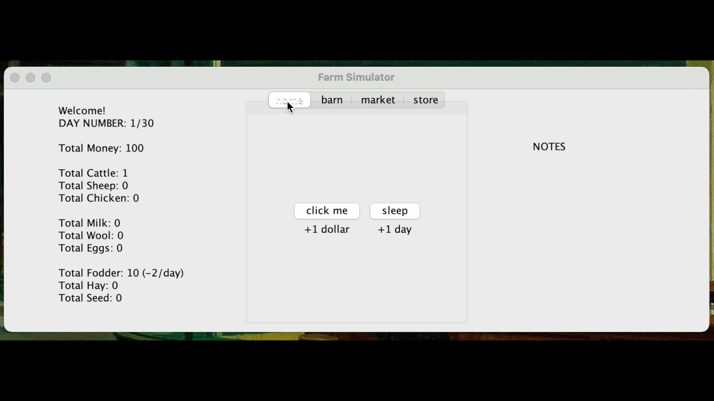

# FarmingSim
simple farming simulation made with SWING (Java)

## About the Project

## Getting Started

1. download files onto your computer
2. open an IDE capable of running Java
3. run the Main.java class
4. Have fun!

## Usage
### How to Play?
Welcome to your very own farming simulator! Where you'll be able to purchase (cattle, sheep, chickens) and sell (milk, wool, eggs) goods.

You have 30 days to make as much money as possible; so make wise choices!

~

On the leftmost panel you have your statistics regarding the current state of your farm.

On the rightmost panel you have notes; such as 'no more fodder' and 'no more milk'.

In the middle panels, you have your farm and all of the options you can choose.

~

### Home Screen
on the home screen you have two options. 
- you can either click to gain $1 per click
- you can sleep to start a new day.

~

### Barn Screen
on the barn screen you have three options.
- you can milk your cows x2 a day
- you can shear your sheep x1 a day
- you can grab your chicken eggs x1 a day

~

### Market Screen
on the market screen you can sell your goods.
- sell your milk jugs
- sell your wool
- sell a dozen (12) eggs

~

### Store Screen
on the store screen you can buy more animals or buy more food for your animals.
- buy cow
- buy sheep
- buy chicken
- buy fodder (food for cows)
- buy hay (food for sheep)
- buy seed (food for chickens

~

### Game Over
Once you have played for 30 (in game) days, the game is over and you are presented with a screen of your statistics!

## Built Using
- [Java](https://docs.oracle.com/javase/7/docs/api/)
- [Swing](https://docs.oracle.com/javase/7/docs/api/javax/swing/package-summary.html)

## Contact
Any comments, questions or concerns?

Contact Jacqueline Molina: molina.jq19@gmail.com
